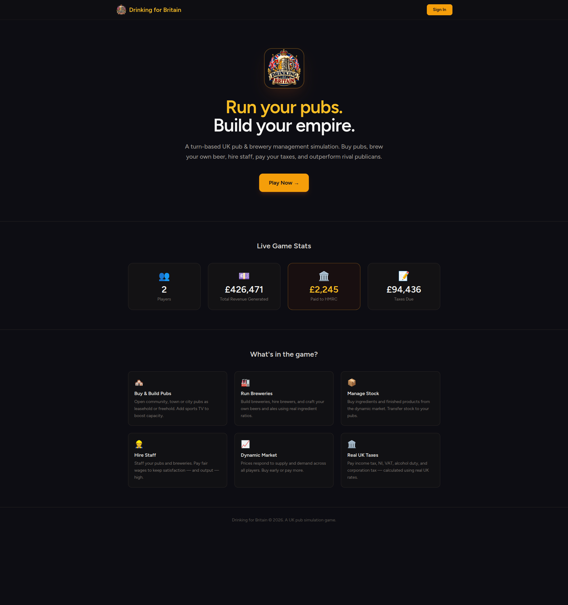
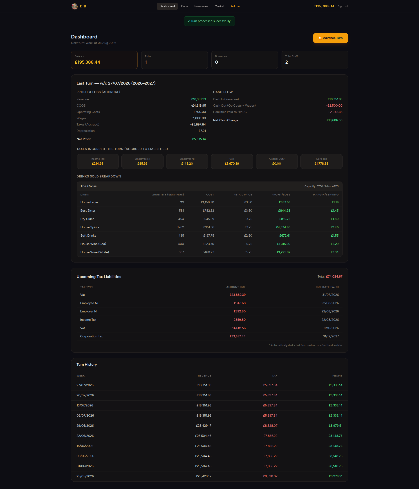
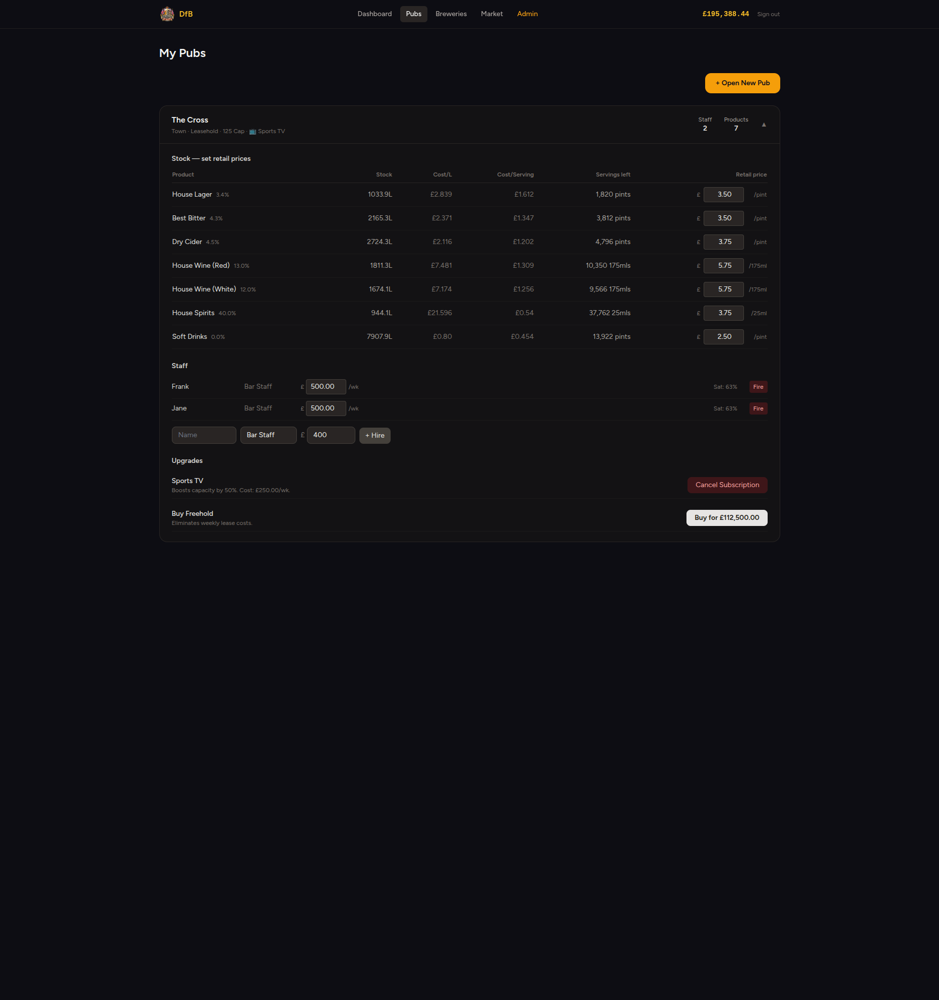
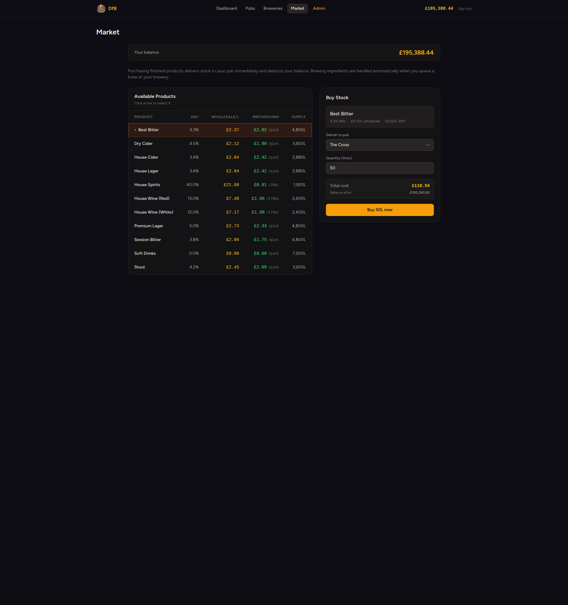
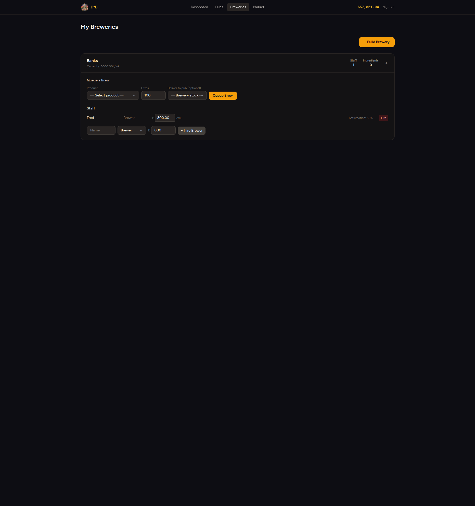
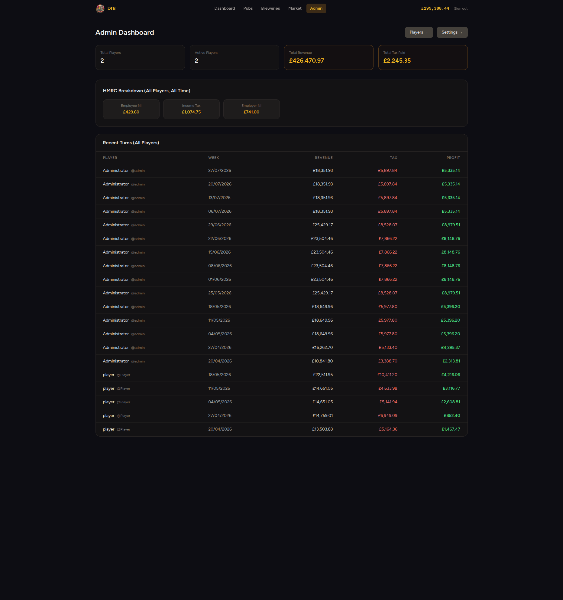
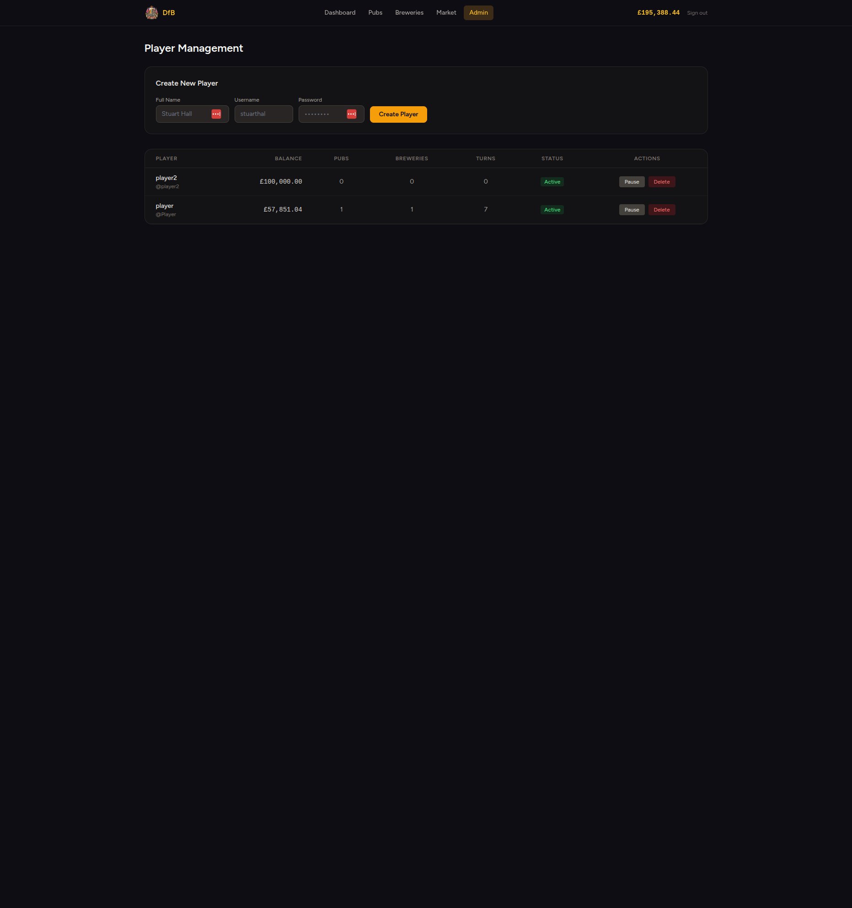
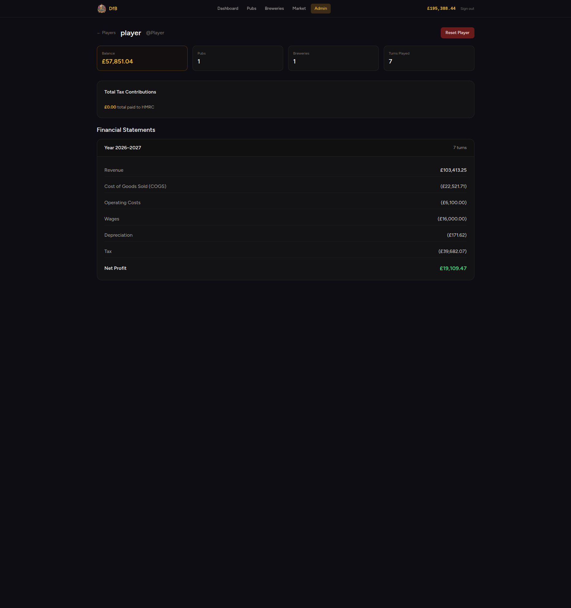

# Drinking for Britain

A web-based pub and brewery management simulation game where players buy pubs, brew beer, manage staff, and set prices to dominate the UK hospitality market.

## Screenshots










## Overview

Players take on the role of a hospitality entrepreneur. The goal is to build an empire of pubs and breweries, managing finances turn-by-turn (weekly). Beyond simply running a successful business, a core purpose of the game is to demonstrate the heavy financial burden placed on the UK hospitality industry, highlighting exactly how much pubs contribute to the economy through various taxes and duties.

### Key Features

*   **Pub Management:** 
    *   Acquire properties as either **Leasehold** or **Freehold**.
    *   Choose locations: **Community** (70 cap), **Town** (125 cap), or **City** (275 cap).
    *   Hire staff to meet capacity demands (wage & satisfaction management).
    *   Set per-serving retail prices (Pint for beer/cider, 175ml for wine, 25ml for spirits).
    *   Invest in upgrades like Sports TV to boost demand.
*   **Brewery Operations:**
    *   Build breweries of varying capacities (Micro, Regional, National).
    *   Queue brewing tasks for different beer types (Best Bitter, Premium Lager, etc.) that take turns to mature.
*   **Dynamic Market:**
    *   Purchase wholesale products (Beer, Cider, Wine, Spirits, Soft Drinks).
    *   Prices fluctuate and are tracked per litre, while retail sales are automatically converted to standard UK servings.
*   **Turn-Based Engine:**
    *   Progress is calculated weekly via a turn processor.
    *   Revenue and demand are dynamically calculated based on price competitiveness, pub location, staff capacity, and amenities.
*   **Realistic Financial Reporting & Taxation:**
    *   Generates detailed Profit & Loss (P&L) statements for each turn.
    *   Accurate tracking of liabilities including Income Tax, National Insurance (Employee & Employer), VAT, Alcohol Duty, and Corporation Tax.
    *   Taxes and duties are accrued and paid on true-to-life payment dates (e.g., VAT quarterly, Corporation Tax annually).
*   **Administration:**
    *   Admin dashboard for managing players (pause/delete/reset), viewing player P&L histories, and managing global game settings (capacities, costs, market fluctuations).

### Recent Additions
*   **Pub Upgrades:** Players can now upgrade existing pubs with Sports TV (incurring a 4-week upfront installation cost) or convert them from Leasehold to Freehold (dynamically affecting the pub's asset value and straight-line depreciation).
*   **Dashboard Improvements:** Upcoming tax liabilities are now cleanly grouped and summarized by type and due date.
*   **Admin Settings:** The global game settings UI is now fully functional, allowing real-time edits to properties like starting cash balances and game constants.

## Tech Stack

*   **Backend:** Laravel (PHP 8.3)
*   **Frontend:** React with Inertia.js
*   **Styling:** Tailwind CSS (Vanilla)
*   **Database:** PostgreSQL

## Setup & Installation

1.  **Clone the repository.**
2.  **Install dependencies:**
    ```bash
    composer install
    npm install
    ```
3.  **Environment Setup:**
    Copy `.env.example` to `.env` and configure your database settings.
    ```bash
    cp .env.example .env
    php artisan key:generate
    ```
4.  **Database Migration & Seeding:**
    Run migrations and seed the database with initial settings, products, and a default admin user.
    ```bash
    php artisan migrate --seed
    ```
5.  **Build Assets:**
    ```bash
    npm run build
    ```
    *(For development, run `npm run dev`)*
6.  **Serve:**
    ```bash
    php artisan serve
    ```

## Development Notes

### Authentication
The game uses a customized authentication system. Users log in with a **username and password** (instead of the default Laravel email). 

*   **Admin Login:** Username: `admin` (seeded by default, password: `password`)
*   **Player Login:** Username: `player` (seeded by default, password: `password`)

Note: Public registration and password reset flows are intentionally disabled.

### Code Architecture
*   **Controllers:** Standard Laravel controllers handle web requests. `GameController` handles the complex turn-processing logic.
*   **Models:** Extended from a custom `BaseModel` to ensure consistent UK date formatting (`d/m/Y`).
*   **UI:** React components in `resources/js/Pages` utilize Tailwind for styling and Inertia for seamless SPA-like navigation without full page reloads.

### Market Pricing Logic
The backend engine calculates everything in **litres** for consistency. 
When interacting with the UI (Market & Pub Stock):
*   **Wholesale** is shown per-litre.
*   **Retail** is shown and set per-serving. The serving size and label (Pint, 175ml, 25ml) are dynamically determined by the product's ABV (Alcohol By Volume) via helpers in the `MarketListing` model.
